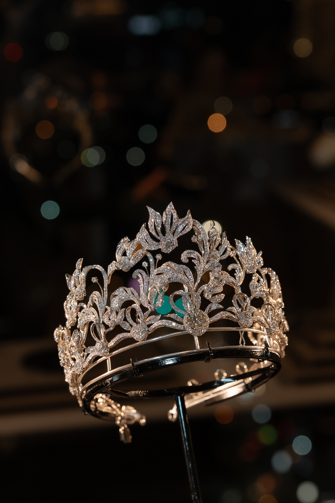

<div align="center">

# Heritage FineArt Jewelry

### Luxury Antique Jewelry Landing Page

An editorial-style landing page for **Heritage FineArt Jewelry**, designed to present antique and fine jewelry with a refined, premium visual direction.




</div>

---

## Overview

This project is a luxury landing page website for **Heritage FineArt Jewelry**.  
It was created to communicate the company's antique and fine jewelry identity through an elegant web experience, with sections for brand storytelling, jewelry eras, product collections, private events, and client enquiries.

The main purpose is to help Heritage FineArt Jewelry present its brand online and guide visitors toward private appointments or enquiries.

## Key Features

- Premium hero section with luxury visual direction
- Moving marquee for jewelry eras and provenance keywords
- Historical eras collection section
- Product collection cards with modal details
- Provenance/about section with video presentation
- Private event section
- Contact and private enquiry form
- Responsive layout for desktop and mobile

## Tech Stack

| Area | Technology |
| --- | --- |
| Frontend | HTML, CSS, JavaScript |
| Build Tool | Vite |
| Style | Custom CSS |
| Assets | Local images and video |

## Project Structure

```text
heritage-004-vanilla/
├── index.html
├── public/
│   ├── images/
│   └── videos/
├── src/
│   ├── main.js
│   └── style.css
├── package.json
└── README.md
```

## Getting Started

Install dependencies:

```bash
npm install
```

Run the development server:

```bash
npm run dev
```

Build for production:

```bash
npm run build
```

Preview the production build:

```bash
npm run preview
```

## Acknowledgements

This project was developed with assistance from **Codex** for coding and implementation, and **Claude** for design direction and layout exploration.

---

# ภาษาไทย

## ภาพรวมโปรเจกต์

โปรเจกต์นี้คือเว็บไซต์ **Landing Page สำหรับ Heritage FineArt Jewelry**  
ออกแบบขึ้นเพื่อถ่ายทอดภาพลักษณ์ของบริษัทในฐานะแบรนด์จิวเวลรี่แอนทีคและ Fine Jewelry ผ่านเว็บไซต์ที่ให้ความรู้สึกหรูหรา เรียบงาม และมีลักษณะ editorial

จุดประสงค์หลักของเว็บไซต์นี้คือการแนะนำบริษัท Heritage FineArt Jewelry, นำเสนอคอลเลกชันเครื่องประดับ, เล่าเรื่องยุคสมัยของจิวเวลรี่ และนำผู้เข้าชมไปสู่การติดต่อสอบถามหรือนัดหมายแบบส่วนตัว

## ฟีเจอร์หลัก

- Hero section สำหรับสร้าง first impression ของแบรนด์
- Marquee ข้อความเกี่ยวกับ jewelry eras และ provenance
- Section แสดงยุคสมัยของเครื่องประดับ
- Product collection cards พร้อม modal รายละเอียดสินค้า
- Section provenance/about พร้อมวิดีโอ
- Section private event
- ฟอร์มติดต่อและ private enquiry
- Responsive layout รองรับทั้ง desktop และ mobile

## เทคโนโลยีที่ใช้

| ส่วน | เทคโนโลยี |
| --- | --- |
| Frontend | HTML, CSS, JavaScript |
| Build Tool | Vite |
| Style | Custom CSS |
| Assets | รูปภาพและวิดีโอภายในโปรเจกต์ |

## วิธีใช้งาน

ติดตั้ง dependencies:

```bash
npm install
```

รัน development server:

```bash
npm run dev
```

Build สำหรับ production:

```bash
npm run build
```

Preview production build:

```bash
npm run preview
```

## Acknowledgements

โปรเจกต์นี้พัฒนาโดยมี **Codex** ช่วยในด้านการเขียนโค้ดและ implementation และมี **Claude** ช่วยในด้าน design direction และการสำรวจ layout
